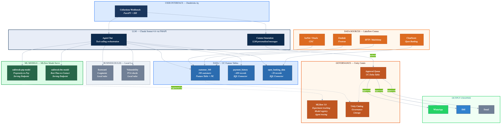

# Oakbrook Collections Brain

AI-powered collections agent demo for Oakbrook Finance, built as a Databricks App on GCP.

## What It Demonstrates

This demo showcases how Databricks capabilities on **GCP europe-west2** combine into an intelligent collections agent:

| Capability | Databricks Component | What It Does |
|---|---|---|
| Customer 360 | **Feature Tables** (Unity Catalog) | Unified customer profile — reads from real UC tables via SQL |
| Propensity-to-Pay | **MLflow Model Serving** | Real-time ML scoring — likelihood of payment based on ~1,000 features |
| Best-Time-to-Contact | **MLflow Model Serving** | Optimal day/time/channel for outreach based on behavioural patterns |
| Payment Signals | **Structured Streaming** | Real-time events — DD cancellations, payment failures, partial payments |
| Collection Scorecard | **MCP Server** | Validation logic matching customers to 6 strategy segments |
| Personalised Comms | **RAG** (Vector Search) | Tone-appropriate message generation — auto-selects friendly/empathetic/formal/sensitive |
| Open Banking | **ClearScore Integration** | Verified affordability data for FCA-compliant payment plan recommendations |
| Vulnerability Screening | **FCA Consumer Duty** | Automated vulnerability assessment before any escalation action |
| Agent Orchestration | **FMAPI + Tool-Calling** | Claude Sonnet 4.6 orchestrates all tools via streaming tool-calling loop |
| Audit Trail | **MLflow 3.0 Tracing** | Real spans emitted for every agent decision — replaces Langfuse |
| Agent Memory | **PostgreSQL** (Cloud SQL) | Persistent conversation history across sessions |
| Output Channels | **WhatsApp / SMS / Email** | Generated comms delivered via WhatsApp Business API (primary) |

## Architecture



```
User Interface (Databricks App — FastAPI + SSE streaming)
    │
    ▼
AI Agent (Claude Sonnet 4.6 via FMAPI — tool-calling loop)
    │
    ├─→ ML Models (MLflow Model Serving)
    │     ├── Propensity-to-Pay (ptp-v3.2.1)
    │     └── Best-Time-to-Contact (btc-v2.1.0)
    │
    ├─→ Data Lookup (UC Feature Tables + Structured Streaming)
    │     ├── Customer 360 (main.oakbrook_collections.customer_360)
    │     ├── Payment History (main.oakbrook_collections.payment_history)
    │     └── Open Banking (main.oakbrook_collections.open_banking_data)
    │
    ├─→ Business Rules & Comms
    │     ├── Collection Scorecard (MCP Server v2.4)
    │     ├── Vulnerability Engine (FCA Consumer Duty)
    │     └── Comms Generator (RAG / Vector Search)
    │
    ├─→ Output Channels
    │     ├── WhatsApp (primary — Business API)
    │     ├── SMS (gateway)
    │     └── Email (formal notices)
    │
    └─→ Observability + Memory
          ├── MLflow 3.0 Tracing (audit trail — replaces Langfuse)
          ├── Unity Catalog (governance, lineage)
          └── Agent Memory (PostgreSQL / Cloud SQL)

Data Sources (Lakeflow Connect)
    ├── Oracle DB (Loan Management — CDC)
    ├── SQL Server / IceNet (CDC)
    ├── Zendesk (Customer Contacts — Streaming)
    ├── SFTP (Collections Providers)
    └── ClearScore (Open Banking API)
```

## GCP europe-west2 Availability

All core capabilities are **now available** in Oakbrook's region:

| Capability | Status | Notes |
|---|---|---|
| FMAPI (Claude, Llama) | **GA** | Claude Sonnet served in EU, data stays in Europe |
| Model Serving | **GA** | CPU + GPU, custom + external models |
| MLflow 3.0 Tracing | **GA** | All GCP regions — native replacement for Langfuse |
| Vector Search (RAG) | **GA** | For comms template retrieval |
| MCP Server | **Public Preview** | Already enabled for Oakbrook |
| Databricks Apps | **GA** | This demo runs as a Databricks App |
| Lakeflow Connect | **GA** | Oracle CDC, SQL Server — key for loan migration |
| Feature Tables (UC) | **GA** | Customer 360 Feature Table |
| AgentBricks (KA/SA) | Coming ~May 2026 | No-code agent builder. Use FMAPI + custom tools today. |

**Previous blockers resolved:** Model Serving and FMAPI — which blocked the Customer Service Agent and Credit Decisioning UCOs — are now fully available.

## Quick Start

### 1. Set Up Feature Tables

Run the setup notebook to create real Unity Catalog tables:

```
/Workspace/Users/YOU@databricks.com/oakbrook-collections-brain/01_setup_feature_tables
```

This creates `main.oakbrook_collections.customer_360`, `payment_history`, and `open_banking_data`.

### 2. Deploy to Databricks (GCP)

```bash
# Authenticate
databricks auth login --host https://YOUR-WORKSPACE.gcp.databricks.com --profile e2-gcp

# Create the app
databricks apps create --profile e2-gcp --json '{"name": "oakbrook-collections-brain"}'

# Sync and deploy
databricks sync . /Workspace/Users/YOU@databricks.com/apps/oakbrook-collections-brain --profile e2-gcp --watch=false
databricks apps deploy oakbrook-collections-brain \
  --source-code-path /Workspace/Users/YOU@databricks.com/apps/oakbrook-collections-brain \
  --profile e2-gcp
```

### 3. Run Locally

```bash
pip install -r requirements.txt
DATABRICKS_HOST=YOUR-WORKSPACE.gcp.databricks.com DATABRICKS_TOKEN=your-token \
  uvicorn backend.main:app --port 8000
# Open http://localhost:8000
```

## Demo Walkthrough

The app has three tabs:

### Agent Chat
1. **Portfolio sidebar** — 5 customers with risk segments, days past due, and balances
2. **Click a customer** — Pre-fills analysis prompt
3. **Streaming response** — Tool execution chips appear in real-time, then text streams token-by-token
4. **Agent trace** — Expandable panel shows every tool call with Databricks component mapping
5. **Generate comms** — Draft WhatsApp/SMS/email with auto-selected tone

### Architecture
- System diagram showing all layers and data flows
- Data flow description from ingestion through to output channels

### How to Build This
- 13 component cards with GCP-specific documentation links
- GCP europe-west2 availability matrix
- Production roadmap (6 steps)

### Sample Prompts

- "Show me the full portfolio and prioritise by risk"
- "Run a full analysis on C-10001 — models, scorecard, vulnerability, and strategy"
- "Check Open Banking affordability for C-10002 and draft a WhatsApp message"
- "Assess vulnerability for C-10003 and recommend a sensitive approach"
- "Generate a weekly contact plan for all customers"

## Data Layer

The app reads from **real Unity Catalog Feature Tables** when running on Databricks, with local fallback for development:

| Table | UC Path | Description |
|---|---|---|
| Customer 360 | `main.oakbrook_collections.customer_360` | 5 customers — credit cards + debt consolidation loans |
| Payment History | `main.oakbrook_collections.payment_history` | 22 payment events (paid, missed, DD cancelled, partial) |
| Open Banking | `main.oakbrook_collections.open_banking_data` | ClearScore affordability data for 3 customers |

Additional in-memory data:
- **Collection scorecard** — 6 segments mapping to strategies (served via MCP Server pattern)
- **Communication templates** — 6 templates across tones (served via RAG pattern)
- **Vulnerability rules** — FCA Consumer Duty compliance logic

## File Structure

```
oakbrook-demo/
├── app.yaml                  # Databricks App config (serving endpoint resource)
├── requirements.txt          # Python deps (fastapi, openai, mlflow, databricks-sdk, databricks-sql-connector)
├── backend/
│   ├── __init__.py
│   ├── main.py               # FastAPI routes (streaming + non-streaming chat, debug)
│   ├── agent.py              # AI agent with tool-calling loop + MLflow 3.0 tracing
│   ├── data.py               # UC Feature Table reads (SQL connector) + local fallback
│   └── memory.py             # Conversation memory (PostgreSQL / in-memory fallback)
├── frontend/
│   └── index.html            # 3-tab UI: Agent Chat, Architecture, How to Build This
├── notebooks/
│   └── 01_setup_feature_tables.py  # Creates UC tables with synthetic data
└── docs/
    ├── oakbrook_architecture.mmd   # Mermaid source
    └── oakbrook_architecture.png   # Architecture diagram
```

## Production Roadmap

To move from demo to production, Oakbrook would:

1. **Data Ingestion** — Materialise Customer 360 from Oracle (Lakeflow Connect CDC) + IceNet + Zendesk. DLT pipelines for Bronze → Silver → Gold.
2. **Feature Engineering** — Create Feature Tables in UC with ~1,000 features from historical collections data. Include Open Banking signals, ClearScore bands, contact outcomes.
3. **Model Training** — Train propensity-to-pay and best-time-to-contact using MLflow experiment tracking. Register in MLflow Model Registry.
4. **Model Serving** — Deploy to real-time Model Serving endpoints with Feature Table auto-lookup. A/B testing between versions.
5. **Agent + Observability** — Build custom agent using FMAPI + tool-calling. MCP Server for scorecard. Vector Search for RAG comms. MLflow 3.0 tracing for full FCA audit trail (replaces Langfuse).
6. **Production App** — Databricks App with workspace SSO. WhatsApp Business API for outreach delivery. Cloud SQL for session memory. Target: >20% Cure/Roll uplift, 70hr/month automation savings.
